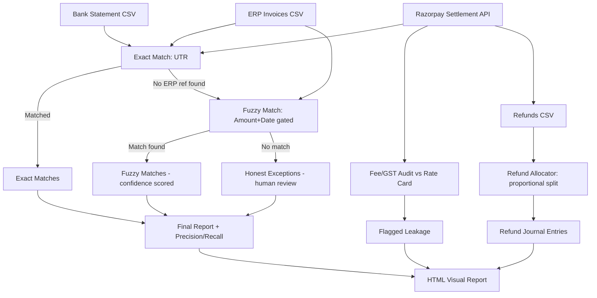

# Multi-Loop Finance Reconciliation — AI-Assisted

Built for Razorpay AI Buildathon 2026 — Track T4 (AI Finance Controller)

## Problem
Merchants reconciling Razorpay settlements against bank statements and ERP invoices (Tally/Zoho) still do this manually at month-end — and even after matching, nobody automatically verifies the fee/GST deduction was correct, or that partial refunds get split and booked properly. Razorpay's Settlement Recon API and Smart Collect 2.0 solve payment-side reconciliation, but matching into a merchant's own ERP ledger, auditing fee correctness, and allocating partial refunds all remain manual/unsolved — confirmed gap, per public integration docs: "requires bespoke API integration and matching logic... rarely offered."

## What this does
One pipeline, one synthetic dataset, three closed finance-ops loops:

### 1. Settlement Reconciliation (PS1)
Reconciles three messy data sources — bank statement, Razorpay settlement report, ERP invoices:
- **Exact match** — ties all 3 sources via UTR number when present
- **Fuzzy match** — for rows missing a clean reference, gates candidates on amount + date tolerance (reliable numeric signals), then uses name similarity (`rapidfuzz`) only as a confidence score — not as the primary filter
- **Honest exceptions** — anything genuinely unmatched is flagged for human review, never hidden or cherry-picked

### 2. Fee / GST Split Auditor (PS2)
Razorpay tells merchants what fee/GST was deducted, but nothing verifies it was actually *correct* per the contracted rate card. This recomputes expected fee (2.5% of order) + GST (18% of fee), compares against actual deducted values, and flags anything off by more than ₹0.50 — catching silent leakage from rate-card bugs or stale promo pricing.

### 3. Partial Refund Allocator (PS3)
When a refund happens — full or partial — fee/GST/net must be split proportionally and tied back to the original settlement. This is manual ratio math today. The allocator computes `refund_ratio = refund_amount / original_order_amount`, splits fee/GST/net proportionally, and generates a ledger-ready journal entry per refund, tied to its original settlement ID.

## Pipeline Flow



## Results (on 500-transaction synthetic dataset)
**PS1 — Reconciliation**
- **87.8% auto-matched**, remainder honestly routed to human review
- **100% precision/recall** against ground truth (see Limitations below)
- **₹11,77,253 reconciled** automatically

**PS2 — Fee/GST Audit**
- 500 settlements audited, **2.8% flagged** for rate-card discrepancy
- **₹54.66 total leakage** detected and itemized (not estimated)

**PS3 — Refund Allocator**
- 18 refund events processed, **100% allocated** to journal entries
- **₹36,781.25 net** proportionally reversed across full + partial refunds

All three loops run in well under a second combined — see terminal throughput output per stage.

## Escalation Path (human-review routing)
Nothing this pipeline can't confidently resolve is silently dropped or auto-approved — every loop routes uncertainty to a specific, named output a finance-ops reviewer picks up:

| Loop | Escalation output | Who acts on it | Trigger |
|---|---|---|---|
| PS1 Reconciliation | `data/final_exceptions_report.csv` | Reconciliation analyst | No UTR/amount+date/name match found within tolerance — genuinely unresolved, or amount+date matched by coincidence with name similarity below the 40% trust floor (see `failure_log.md` Bug 4) |
| PS2 Fee/GST Audit | `data/fee_audit_flagged.csv` | Finance-ops / merchant success | Deducted fee or GST differs from the rate-card expectation by more than ₹0.50 |
| PS3 Refund Allocator | `data/refund_exceptions.csv` | Finance-ops | Refund event references a `settlement_id` with no matching original settlement — can't compute a ratio |

Every row in these three files carries a `reason` string explaining exactly why it needs a human, not just that it does — that's the audit trail (rubric requirement), not a black-box flag. In a real deployment these CSVs would feed a ticketing queue (e.g. one row = one Jira/Freshdesk ticket) instead of a file; the routing logic itself doesn't change.

## Why this approach (not pure LLM)
Research (Prakash et al., 2025) shows small domain-tuned models can outperform general LLMs on narrow matching tasks. We use `rapidfuzz` and deterministic rate-card math (offline, free) for all three loops, reserving LLM calls only for genuinely ambiguous edge cases — cheaper, faster, and more explainable than calling an LLM on every row. Every automated decision — match, fee flag, refund allocation — includes a human-readable `reason` string (audit trail).

## Honest Limitations
100% precision/recall on PS1 was achieved on synthetic data intentionally designed with resolvable patterns (amount/date always reliable by construction). This is a controlled demo, not a production accuracy claim — real-world data would include multi-invoice splits and cross-currency cases not simulated here. See `failure_log.md` for documented bugs and fixes during development.

## Stack
Python 3.14, pandas, rapidfuzz — no paid APIs required for core pipeline.

## Run it
```bash
python3 -m venv venv
source venv/bin/activate
pip install -r requirements.txt
python3 src/run_all.py
```

## Files
- `src/generate_data.py` — synthetic dataset generator (injected messiness, fee glitches, refunds, ground truth)
- `src/exact_match.py` — PS1 layer 1: UTR-based exact matching
- `src/fuzzy_match.py` — PS1 layer 2: amount/date-gated fuzzy matching
- `src/main.py` — merges PS1 results, computes real precision/recall
- `src/fee_audit.py` — PS2: recomputes expected fee/GST, flags rate-card discrepancies
- `src/refund_allocator.py` — PS3: proportional fee/GST/net split per refund, ledger-ready journal
- `src/generate_report.py` — builds the HTML dashboard across all 3 loops
- `src/run_all.py` — one-command full pipeline run
- `failure_log.md` — documented bugs + fixes from development
- `data/` — generated datasets and outputs

**Scalability note:** All three loops together process 500 transactions + 18 refunds in well under a second. Runtime is dominated by pandas I/O overhead, not matching/audit logic — matching is bounded by blocking (date+amount gating) and the fee audit/refund allocation are both O(n), so this scales cleanly to thousands of records without architectural changes.
